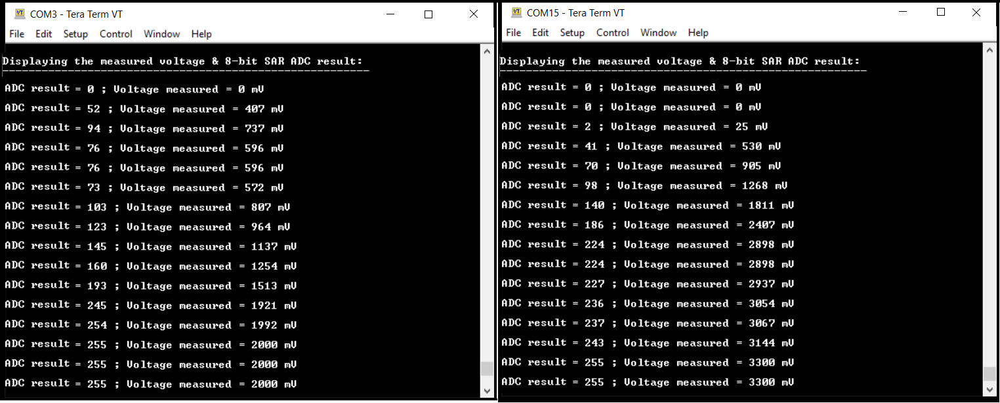
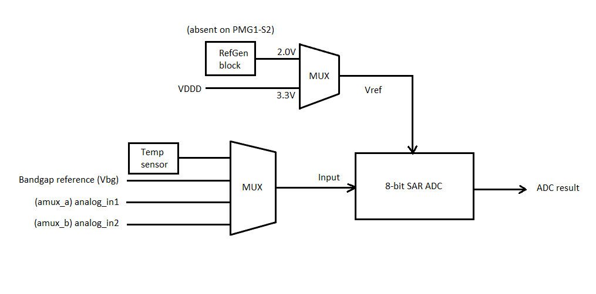
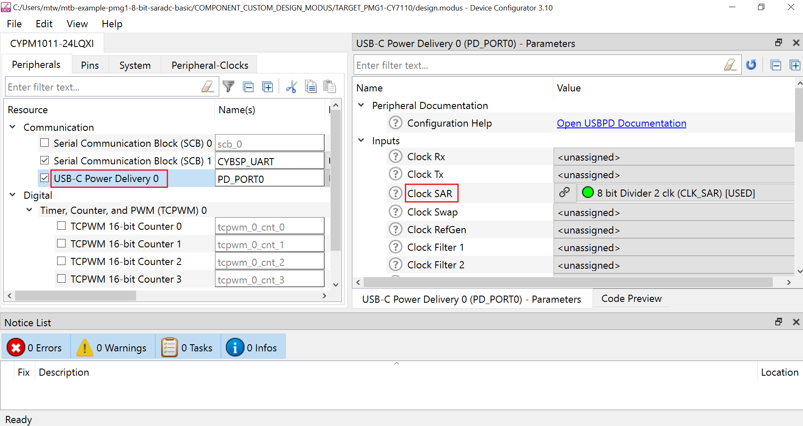
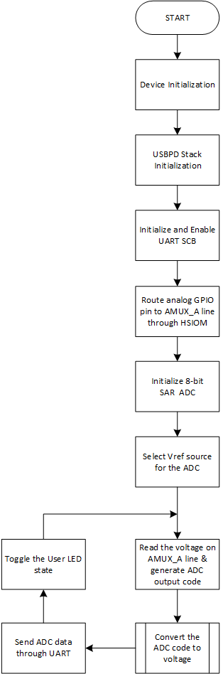

# EZ-PD&trade; PMG1 MCU: 8-bit SAR ADC basic

This code example demonstrates the method of using the 8-bit SAR ADC in the USBPD block on EZ-PD&trade; PMG1 MCU to measure the external input voltage. The measured voltage values and the corresponding ADC results are displayed on a UART terminal.


[View this README on GitHub.](https://github.com/Infineon/mtb-example-pmg1-8-bit-saradc-basic)

[Provide feedback on this code example.](https://cypress.co1.qualtrics.com/jfe/form/SV_1NTns53sK2yiljn?Q_EED=eyJVbmlxdWUgRG9jIElkIjoiQ0UyMzM2NzciLCJTcGVjIE51bWJlciI6IjAwMi0zMzY3NyIsIkRvYyBUaXRsZSI6IkVaLVBEJnRyYWRlOyBQTUcxIE1DVTogOC1iaXQgU0FSIEFEQyBiYXNpYyIsInJpZCI6ImVhc292YXJnaGVzZSIsIkRvYyB2ZXJzaW9uIjoiMi4yLjAiLCJEb2MgTGFuZ3VhZ2UiOiJFbmdsaXNoIiwiRG9jIERpdmlzaW9uIjoiTUNEIiwiRG9jIEJVIjoiV0lSRUQiLCJEb2MgRmFtaWx5IjoiVFlQRS1DIn0=)


## Requirements

- [ModusToolbox&trade;](https://www.infineon.com/modustoolbox) v3.0 or later (tested with v3.0)
- Board support package (BSP) minimum required version: 3.0.0
- Programming language: C
- Associated parts: All [EZ-PD&trade; PMG1 MCU](https://www.infineon.com/PMG1) parts


## Supported toolchains (make variable 'TOOLCHAIN')

- GNU Arm&reg; Embedded Compiler v10.3.1 (`GCC_ARM`) – Default value of `TOOLCHAIN`
- Arm&reg; Compiler v6.16 (`ARM`)
- IAR C/C++ Compiler v9.30.1 (`IAR`)


## Supported kits (make variable 'TARGET')

- [EZ-PD&trade; PMG1-S0 Prototyping Kit](https://www.infineon.com/CY7110) (`PMG1-CY7110`) - Default value of `TARGET`
- [EZ-PD&trade; PMG1-S1 Prototyping Kit](https://www.infineon.com/CY7111) (`PMG1-CY7111`)
- [EZ-PD&trade; PMG1-S2 Prototyping Kit](https://www.infineon.com/CY7112) (`PMG1-CY7112`)
- [EZ-PD&trade; PMG1-S3 Prototyping Kit](https://www.infineon.com/CY7113) (`PMG1-CY7113`)
- [EZ-PD&trade; PMG1-B1 Prototyping Kit](https://www.infineon.com/EVAL_PMG1_B1_DRP) (`EVAL_PMG1_B1_DRP`)
- [EZ-PD&trade; PMG1-S1 DRP Prototyping Kit](https://www.infineon.com/EVAL_PMG1_S1_DRP) (`EVAL_PMG1_S1_DRP`)
- [EZ-PD&trade; PMG1-S3 DRP Prototyping Kit](https://www.infineon.com/EVAL_PMG1_S3_DUALDRP) (`EVAL_PMG1_S3_DUALDRP`)


## Hardware setup

1.	Connect the PMG1 prototyping kit to your PC using a USB cable through the KitProg3 USB Type-C port (J1). This cable is used for programming the PMG1 device and can be used during debugging. In addition, it transfers the UART data from the serial port to the PC to display it on a serial monitor.

2.	Connect the PMG1 USB PD sink port (J10) to a USB-C power adapter/USB port on the PC using a Type-C/Type-A to Type-C cable to power the PMG1 device for normal operation.

3.	Connect the UART Tx and UART Rx lines from the PMG1 kit to the KitProg3 as shown in the following table to establish a UART connection between KitProg3 and the PMG1 device for the following revisions of the PMG1 prototyping kits. Note that in this application, 
only the UART Tx line is used to transmit the voltage data onto a serial monitor.

    **Table 1. UART connection for PMG1 kit**

     PMG1 prototyping kit  | UART Tx | UART Rx
     :-------       | :------------ | :----------  
     PMG1-CY7110 (revision 3 or lower) | J6.10 to J3.8 | J6.9 to J3.10  
     PMG1-CY7111 (revision 2 or lower) | J6.10 to J3.8 | J6.9 to J3.10
     PMG1-CY7112 (revision 2 or lower) | J6.10 to J3.8 | J6.9 to J3.10
     PMG1-CY7113 (revision 3 or lower) | J6.10 to J3.8 | J6.9 to J3.10
     EVAL_PMG1_B1_DRP | SW5 to 1-2 position | SW4 to 1-2 position
	  EVAL_PMG1_S3_DUALDRP | N/A  | N/A
	  EVAL_PMG1_S1_DRP | N/A   | N/A
     
     <br>
     
    > **Note:** All prototyping kits with a higher revision have UART lines internally connected. Therefore, external wiring is not required. 
    If UART DEBUG PRINT messages are enabled, UART connection is needed. For more details, see [Compile-time configurations](#compile-time-configurations).

4. Use a DC voltage source as input to apply an analog voltage to the ADC. Wire up the negative terminal of the voltage source to the ground pin (J6.3) on the PMG1 kit. Connect the positive terminal of the voltage source to the GPIO pin on the PMG1 kit as follows:

    **Table 2. Analog input connection to PMG1 kit**

     PMG1 prototyping kit  | Analog GPIO pin
     :-------       | :------------
     PMG1-CY7110 | J7.12 (P1.1)
     PMG1-CY7111 | J6.13 (P1.1)
     PMG1-CY7112 | J6.13 (P3.4)
     PMG1-CY7113 | J7.7 (P4.0)
	  EVAL_PMG1_S1_DRP | J6.13 (P1.1)
	  EVAL_PMG1_S3_DUALDRP | J7.7 (P4.0)
     EVAL_PMG1_B1_DRP | J7.7 (P3.0)
     
     <br>

See the kit user guide for more details on configuring the board.


## Software setup

See the [ModusToolbox&trade; tools package installation guide](https://www.infineon.com/ModusToolboxInstallguide) for information about installing and configuring the tools package.

Install a terminal emulator to display the serial data. Instructions in this document use [Tera Term](https://teratermproject.github.io/index-en.html).

This example requires no additional software or tools.


## Using the code example


### Create the project

The ModusToolbox&trade; tools package provides the Project Creator as both a GUI tool and a command line tool.

<details><summary><b>Use Project Creator GUI</b></summary>

1. Open the Project Creator GUI tool.

   There are several ways to do this, including launching it from the dashboard or from inside the Eclipse IDE. For more details, see the [Project Creator user guide](https://www.infineon.com/ModusToolboxProjectCreator) (locally available at *{ModusToolbox&trade; install directory}/tools_{version}/project-creator/docs/project-creator.pdf*).

2. On the **Choose Board Support Package (BSP)** page, select a kit supported by this code example. See [Supported kits](#supported-kits-make-variable-target).

   > **Note:** To use this code example for a kit not listed here, you may need to update the source files. If the kit does not have the required resources, the application may not work.

3. On the **Select Application** page:

   a. Select the **Applications(s) Root Path** and the **Target IDE**.

   > **Note:** Depending on how you open the Project Creator tool, these fields may be pre-selected for you.

   b.	Select this code example from the list by enabling its check box.

   > **Note:** You can narrow the list of displayed examples by typing in the filter box.

   c. (Optional) Change the suggested **New Application Name** and **New BSP Name**.

   d. Click **Create** to complete the application creation process.

</details>

<details><summary><b>Use Project Creator CLI</b></summary>

The 'project-creator-cli' tool can be used to create applications from a CLI terminal or from within batch files or shell scripts. This tool is available in the *{ModusToolbox&trade; install directory}/tools_{version}/project-creator/* directory.

Use a CLI terminal to invoke the 'project-creator-cli' tool. On Windows, use the command-line 'modus-shell' program provided in the ModusToolbox&trade; installation instead of a standard Windows command-line application. This shell provides access to all ModusToolbox&trade; tools. You can access it by typing "modus-shell" in the search box in the Windows menu. In Linux and macOS, you can use any terminal application.

The following example clones the "[mtb-example-pmg1-8-bit-saradc-basic](https://github.com/Infineon/mtb-example-pmg1-8-bit-saradc-basic)" application with the desired name "My8bitSaradcBasic" configured for the *PMG1-CY7110* BSP into the specified working directory, *C:/mtb_projects*:

   ```
   project-creator-cli --board-id PMG1-CY7110 --app-id mtb-example-pmg1-8-bit-saradc-basic --user-app-name My8bitSaradcBasic --target-dir "C:/mtb_projects"
   ```

The 'project-creator-cli' tool has the following arguments:

Argument | Description | Required/optional
---------|-------------|-----------
`--board-id` | Defined in the <id> field of the [BSP](https://github.com/Infineon?q=bsp-manifest&type=&language=&sort=) manifest | Required
`--app-id`   | Defined in the <id> field of the [CE](https://github.com/Infineon?q=ce-manifest&type=&language=&sort=) manifest | Required
`--target-dir`| Specify the directory in which the application is to be created if you prefer not to use the default current working directory | Optional
`--user-app-name`| Specify the name of the application if you prefer to have a name other than the example's default name | Optional

> **Note:** The project-creator-cli tool uses the `git clone` and `make getlibs` commands to fetch the repository and import the required libraries. For details, see the "Project creator tools" section of the [ModusToolbox&trade; tools package user guide](https://www.infineon.com/ModusToolboxUserGuide) (locally available at {ModusToolbox&trade; install directory}/docs_{version}/mtb_user_guide.pdf).

</details>


### Open the project

After the project has been created, you can open it in your preferred development environment.


<details><summary><b>Eclipse IDE</b></summary>

If you opened the Project Creator tool from the included Eclipse IDE, the project will open in Eclipse automatically.

For more details, see the [Eclipse IDE for ModusToolbox&trade; user guide](https://www.infineon.com/MTBEclipseIDEUserGuide) (locally available at *{ModusToolbox&trade; install directory}/docs_{version}/mt_ide_user_guide.pdf*).

</details>


<details><summary><b>Visual Studio (VS) Code</b></summary>

Launch VS Code manually, and then open the generated *{project-name}.code-workspace* file located in the project directory.

For more details, see the [Visual Studio Code for ModusToolbox&trade; user guide](https://www.infineon.com/MTBVSCodeUserGuide) (locally available at *{ModusToolbox&trade; install directory}/docs_{version}/mt_vscode_user_guide.pdf*).

</details>


<details><summary><b>Keil µVision</b></summary>

Double-click the generated *{project-name}.cprj* file to launch the Keil µVision IDE.

For more details, see the [Keil µVision for ModusToolbox&trade; user guide](https://www.infineon.com/MTBuVisionUserGuide) (locally available at *{ModusToolbox&trade; install directory}/docs_{version}/mt_uvision_user_guide.pdf*).

</details>


<details><summary><b>IAR Embedded Workbench</b></summary>

Open IAR Embedded Workbench manually, and create a new project. Then select the generated *{project-name}.ipcf* file located in the project directory.

For more details, see the [IAR Embedded Workbench for ModusToolbox&trade; user guide](https://www.infineon.com/MTBIARUserGuide) (locally available at *{ModusToolbox&trade; install directory}/docs_{version}/mt_iar_user_guide.pdf*).

</details>


<details><summary><b>Command line</b></summary>

If you prefer to use the CLI, open the appropriate terminal, and navigate to the project directory. On Windows, use the command-line 'modus-shell' program; on Linux and macOS, you can use any terminal application. From there, you can run various `make` commands.

For more details, see the [ModusToolbox&trade; tools package user guide](https://www.infineon.com/ModusToolboxUserGuide) (locally available at *{ModusToolbox&trade; install directory}/docs_{version}/mtb_user_guide.pdf*).

</details>


## Operation

1. Complete the steps listed in the [Hardware setup](#hardware-setup) section.

2. Ensure that the jumper shunt on the power selection jumper (J5) is placed at position 2-3 to enable programming mode for PMG1-CY7110, PMG1-CY7111, PMG1-CY7112, PMG1-CY7113, EVAL_PMG1_S1_DRP, and EVAL_PMG1_S3_DUALDRP prototyping kits. Skip this step for the EVAL_PMG1_B1_DRP kit.

3. Connect the board to your PC using the USB cable through the KitProg3 USB Type-C port (J1).

4. Program the board using one of the following:

   <details><summary><b>Using Eclipse IDE</b></summary>

      1. Select the application project in the Project Explorer.

      2. In the **Quick Panel**, scroll down, and click **\<Application Name> Program (KitProg3_MiniProg4)**.
   </details>


   <details><summary><b>In other IDEs</b></summary>

   Follow the instructions in your preferred IDE.
   </details>


   <details><summary><b>Using CLI</b></summary>

     From the terminal, execute the `make program` command to build and program the application using the default toolchain to the default target. The default toolchain is specified in the application's Makefile but you can override this value manually:
      ```
      make program TOOLCHAIN=<toolchain>
      ```

      Example:
      ```
      make program TOOLCHAIN=GCC_ARM
      ```
   </details>

5. After programming the kit, disconnect the USB cable. Move to the next step for EVAL_PMG1_B1_DRP kit. Change the position on the power selection jumper (J5) to 1-2 to power the kit through the USB PD port (J10) for PMG1-CY7110, PMG1-CY7111, PMG1-CY7112,  PMG1-CY7113, EVAL_PMG1_S1_DRP prototyping kits. For EVAL_PMG1_S3_DUALDRP prototyping kit change the position on the power selection jumper (J5) to 1-2 to power the kit through the USB PD ports (J10 and J14).

6. Reconnect the USB cable to KitProg3 USB Type-C port (J1). Open a terminal program and select the KitProg3 COM port. Set the serial port parameters to 8N1 and 115200 baud.

7. Power the kit through the PMG1 USB PD sink port (J10) using the second USB cable to power the PMG1-CY7110, PMG1-CY7111, PMG1-CY7112, PMG1-CY7113, and EVAL_PMG1_S1_DRP prototyping kits. For EVAL_PMG1_S3_DUALDRP, power the kit through the USB PD ports (J10 or J14). Skip this step for EVAL_PMG1_B1_DRP as it is automatically powered when the kit is connected through the KitProg3 USB Type-C port (J1).

8. The application starts printing **Displaying the measured voltage & 8-bit SAR ADC result:**. Subsequently, the ADC result and the voltage values corresponding to the external voltage applied are displayed on UART terminal at an interval of 0.5 seconds. The user LED toggles each time an output is available on the UART terminal.

9. The default value of the reference voltage for the ADC is 2.0 V. To use the ADC with another reference voltage value, see the [Design and implementation](#design-and-implementation) section.

**Figure 1. Terminal data display for different reference voltages**




## Debugging

You can debug the example to step through the code.


<details><summary><b>In Eclipse IDE</b></summary>

Use the **\<Application Name> Debug (KitProg3_MiniProg4)** configuration in the **Quick Panel**. Ensure that the board is connected to your PC using the USB cable through the KitProg3 USB Type-C port (J1) and for PMG1-CY7110, PMG1-CY7111, PMG1-CY7112, and PMG1-CY7113 prototyping kits the jumper shunt on power selection jumper (J5) is placed at position 1-2.

See the **Debug mode** section in the kit user guide for debugging the application on the CY7110 prototyping kit. See the **Debugging using ModusToolbox&trade;** section in [AN238945](https://infineon.com/AN238945) for EVAL_PMG1_B1_DRP kit. For more details, see the **Program and debug** section in the [Eclipse IDE for ModusToolbox&trade; user guide](https://www.infineon.com/MTBEclipseIDEUserGuide).

</details>


<details><summary><b>In other IDEs</b></summary>

Follow the instructions in your preferred IDE.
</details>

<br>

See the "Debug mode" section in the kit user guide for debugging the application on the CY7110 prototyping kit. For more details, see the "Program and debug" section in the [Eclipse IDE for ModusToolbox&trade; software user guide](https://www.infineon.com/MTBEclipseIDEUserGuide).


## Design and implementation

This code example uses the 8-bit SAR ADC in the USBPD block of PMG1 devices.

An external voltage is applied to the analog input of the ADC. The ADC result is then converted to the corresponding voltage value using an appropriate conversion formula, based on the reference voltage chosen.

**Figure 2. 8-bit SAR ADC block diagram**




The 8-bit SAR ADC block allows the selection of the reference voltage (Vref) from two sources, as shown in **Figure 2**.

- **PMG1-S0, PMG1-S1, PMG1-S3, and EVAL_PMG1_B1_DRP MCUs:** Either Vref = 2.0 V (Bandgap reference) or VDDD (3.3 V)

- **PMG1-S2 MCU:** Only Vref = VDDD (3.3 V) because the RefGen block is absent in PMG1-S2

An external voltage applied through a GPIO pin is routed to the **analog_in1 (amux_a)** input line of the multiplexer using high speed I/O matrix (HSIOM). The multiplexer then routes this analog signal to the SAR ADC input.

The `ADC_VREF` macro in the *main.c* file is used to switch the ADC reference voltage value on PMG1-S0, PMG1-S1, PMG1-S3, and EVAL_PMG1_B1_DRP devices. By default, 2.0 V is selected as the reference voltage as indicated by the macro value `CY_USBPD_ADC_VREF_PROG`. To switch the reference voltage to VDDD (3.3 V), the macro value is replaced by `CY_USBPD_ADC_VREF_VDDD`.

- The **USB-C Power Delivery 0** block is enabled under the 'Peripherals' tab in the Device Configurator to allow the usage of the 8-bit SAR ADC which is an integral part of the USBPD block. Note that under the "Inputs" section, **Clock SAR** is assigned with "8 bit Divider 2 clk" with a suitable divider value, resulting in a 1 MHz clock frequency applied to the 8-bit SAR ADC, as shown in **Figure 3**.

  **Figure 3. 8-bit SAR ADC enabled under USB-C Power Delivery 0 block**
  
  

- Serial Communication Block (SCB) is also enabled and configured as UART to allow serial UART communication to send the ADC data onto the serial port.

- The user LED (LED3) is also configured as output, which toggles the state to indicate the output of the ADC.

**Figure 4. Firmware flowchart**




### Compile-time configurations

The EZ-PD&trade; PMG1 MCU 8-bit SAR ADC basic application functionality can be customized through the compile-time parameters that can be turned ON or OFF through the *main.c* file.

 Macro name          | Description                           | Allowed values 
 :------------------ | :------------------------------------ | :------------- 
 `DEBUG_PRINT`     | Debug print macro to enable UART print | 1u to enable <br> 0u to disable

 <br>


### Resources and settings

**Table 3. Application resources**

 Resource  |  Alias/object     |    Purpose
 :-------- | :-------------    | :------------
USB PD 0   | 8-bit SAR ADC  | 8-bit SAR ADC in the USB PD block used to measure the analog voltage
SCB (PDL)	 | CYBSP_UART		| UART SCB block used for serial communication to send the ADC data through the serial port
LED (BSP)  | CYBSP_USER_LED | User LED to show the output
GPIO (PDL) | CYBSP_AMUX_A 	| GPIO pin in analog drive mode used for connection to the ana_in1 pin of the ADC MUX via HSIOM

<br>


## Related resources

Resources | Links
-----------|------------------
Application notes |[AN232553](https://www.infineon.com/AN232553) – Getting started with EZ-PD&trade; PMG1 MCU on ModusToolbox&trade; software <br> [AN232565](https://www.infineon.com/an232565) – EZ-PD&trade; PMG1 hardware design guidelines and checklist <br> [AN238945](https://www.infineon.com/AN238945) – Getting started with EZ-PD&trade; PMG1-B1 MCU using ModusToolbox&trade;
Code examples  | [Using ModusToolbox&trade;](https://github.com/Infineon/Code-Examples-for-ModusToolbox-Software) on GitHub
Device documentation | [EZ-PD&trade; PMG1 MCU datasheets](https://www.infineon.com/PMG1DS)
Development kits | Select your kits from the [Evaluation board finder](https://www.infineon.com/cms/en/design-support/finder-selection-tools/product-finder/evaluation-board).
Libraries on GitHub | [mtb-pdl-cat2](https://github.com/Infineon/mtb-pdl-cat2) – Peripheral Driver Library (PDL)
Tools  | [ModusToolbox&trade;](https://www.infineon.com/modustoolbox) – ModusToolbox&trade; software is a collection of easy-to-use libraries and tools enabling rapid development with Infineon MCUs for applications ranging from wireless and cloud-connected systems, edge AI/ML, embedded sense and control, to wired USB connectivity using PSoC&trade; Industrial/IoT MCUs, AIROC&trade; Wi-Fi and Bluetooth&reg; connectivity devices, XMC&trade; Industrial MCUs, and EZ-USB&trade;/EZ-PD&trade; wired connectivity controllers. ModusToolbox&trade; incorporates a comprehensive set of BSPs, HAL, libraries, configuration tools, and provides support for industry-standard IDEs to fast-track your embedded application development.

<br>


## Other resources

Infineon provides a wealth of data at [www.infineon.com](https://www.infineon.com) to help you select the right device, and quickly and effectively integrate it into your design.


## Document history

Document title: *CE233677* – *EZ-PD&trade; PMG1 MCU: 8-bit SAR ADC basic*


 Version | Description of change
 ------- | ---------------------
 1.0.0   | New code example
 2.0.0   | Major update to support ModusToolbox&trade; v3.0. This version is not backward compatible with previous versions of ModusToolbox&trade; 
 2.1.0   | Update to support EVAL_PMG1_B1_DRP kit
 2.2.0   | Update to support EVAL_PMG1_S1_DRP and EVAL_PMG1_S3_DUALDRP kits
<br>


All referenced product or service names and trademarks are the property of their respective owners.

The Bluetooth&reg; word mark and logos are registered trademarks owned by Bluetooth SIG, Inc., and any use of such marks by Infineon is under license.


---------------------------------------------------------

© Cypress Semiconductor Corporation, 2022-2024. This document is the property of Cypress Semiconductor Corporation, an Infineon Technologies company, and its affiliates ("Cypress").  This document, including any software or firmware included or referenced in this document ("Software"), is owned by Cypress under the intellectual property laws and treaties of the United States and other countries worldwide.  Cypress reserves all rights under such laws and treaties and does not, except as specifically stated in this paragraph, grant any license under its patents, copyrights, trademarks, or other intellectual property rights.  If the Software is not accompanied by a license agreement and you do not otherwise have a written agreement with Cypress governing the use of the Software, then Cypress hereby grants you a personal, non-exclusive, nontransferable license (without the right to sublicense) (1) under its copyright rights in the Software (a) for Software provided in source code form, to modify and reproduce the Software solely for use with Cypress hardware products, only internally within your organization, and (b) to distribute the Software in binary code form externally to end users (either directly or indirectly through resellers and distributors), solely for use on Cypress hardware product units, and (2) under those claims of Cypress's patents that are infringed by the Software (as provided by Cypress, unmodified) to make, use, distribute, and import the Software solely for use with Cypress hardware products.  Any other use, reproduction, modification, translation, or compilation of the Software is prohibited.
<br>
TO THE EXTENT PERMITTED BY APPLICABLE LAW, CYPRESS MAKES NO WARRANTY OF ANY KIND, EXPRESS OR IMPLIED, WITH REGARD TO THIS DOCUMENT OR ANY SOFTWARE OR ACCOMPANYING HARDWARE, INCLUDING, BUT NOT LIMITED TO, THE IMPLIED WARRANTIES OF MERCHANTABILITY AND FITNESS FOR A PARTICULAR PURPOSE.  No computing device can be absolutely secure.  Therefore, despite security measures implemented in Cypress hardware or software products, Cypress shall have no liability arising out of any security breach, such as unauthorized access to or use of a Cypress product. CYPRESS DOES NOT REPRESENT, WARRANT, OR GUARANTEE THAT CYPRESS PRODUCTS, OR SYSTEMS CREATED USING CYPRESS PRODUCTS, WILL BE FREE FROM CORRUPTION, ATTACK, VIRUSES, INTERFERENCE, HACKING, DATA LOSS OR THEFT, OR OTHER SECURITY INTRUSION (collectively, "Security Breach").  Cypress disclaims any liability relating to any Security Breach, and you shall and hereby do release Cypress from any claim, damage, or other liability arising from any Security Breach.  In addition, the products described in these materials may contain design defects or errors known as errata which may cause the product to deviate from published specifications. To the extent permitted by applicable law, Cypress reserves the right to make changes to this document without further notice. Cypress does not assume any liability arising out of the application or use of any product or circuit described in this document. Any information provided in this document, including any sample design information or programming code, is provided only for reference purposes.  It is the responsibility of the user of this document to properly design, program, and test the functionality and safety of any application made of this information and any resulting product.  "High-Risk Device" means any device or system whose failure could cause personal injury, death, or property damage.  Examples of High-Risk Devices are weapons, nuclear installations, surgical implants, and other medical devices.  "Critical Component" means any component of a High-Risk Device whose failure to perform can be reasonably expected to cause, directly or indirectly, the failure of the High-Risk Device, or to affect its safety or effectiveness.  Cypress is not liable, in whole or in part, and you shall and hereby do release Cypress from any claim, damage, or other liability arising from any use of a Cypress product as a Critical Component in a High-Risk Device. You shall indemnify and hold Cypress, including its affiliates, and its directors, officers, employees, agents, distributors, and assigns harmless from and against all claims, costs, damages, and expenses, arising out of any claim, including claims for product liability, personal injury or death, or property damage arising from any use of a Cypress product as a Critical Component in a High-Risk Device. Cypress products are not intended or authorized for use as a Critical Component in any High-Risk Device except to the limited extent that (i) Cypress's published data sheet for the product explicitly states Cypress has qualified the product for use in a specific High-Risk Device, or (ii) Cypress has given you advance written authorization to use the product as a Critical Component in the specific High-Risk Device and you have signed a separate indemnification agreement.
<br>
Cypress, the Cypress logo, and combinations thereof, ModusToolbox, PSoC, CAPSENSE, EZ-USB, F-RAM, and TRAVEO are trademarks or registered trademarks of Cypress or a subsidiary of Cypress in the United States or in other countries. For a more complete list of Cypress trademarks, visit www.infineon.com. Other names and brands may be claimed as property of their respective owners.
